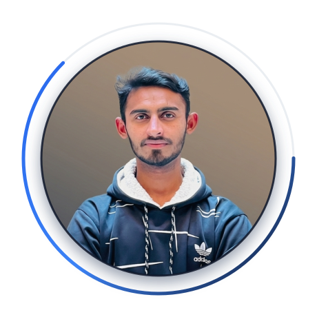

<!-- ======================= HEADER ======================= -->

  

<!-- ======================= INTRO & PROFILE ======================= -->
<table>
  <tr>
    <td width="65%" valign="middle">
      <h1>Hi, I'm Mohsin 👋</h1>
      <h3>Full-Stack Developer · AI/ML Enthusiast</h3>
      

        I build modern, scalable web applications and backend systems, with a growing focus on integrating AI into real-world products.
      

      

        My development experience spans frontend engineering, backend APIs, databases, authentication, and cloud deployment. I also bring hands-on experience as an online trainer, which sharpened my ability to explain complex technical concepts clearly and mentor effectively.
      

      

        Currently expanding my work from full-stack development into <strong>Python, FastAPI, Machine Learning, and AI-powered applications.</strong>
      

       
      

        
        
        
      

    </td>
    <td width="35%" align="center">
      
    </td>
  </tr>
</table>

<!-- ======================= TYPING ANIMATION ======================= -->
 

  

 

<!-- ======================= TECH STACK & FOCUS ======================= -->

  <h2>🛠️ Tech Stack & Expertise</h2>

<table align="center" width="100%">
  <tr>
    <td align="center" width="33%">
      <h3>💻 Core Development</h3>
      
Full-Stack Web Development

      
Backend & API Design

      
Database Architecture

    </td>
    <td align="center" width="33%">
      <h3>🤖 AI & Machine Learning</h3>
      
Python & FastAPI

      
ML Model Integration

      
AI-Powered Applications

    </td>
    <td align="center" width="33%">
      <h3>⚙️ Tools & Mentorship</h3>
      
Cloud Deployment

      
Technical Online Training

      
Scalable Systems

    </td>
  </tr>
</table>

  

<!-- ======================= GITHUB STATS ======================= -->

  <h2>📊 GitHub Stats</h2>

  
  

  

<!-- ======================= FOOTER ======================= -->

  
💬 Always open to a conversation about full-stack development, AI, or a good project to learn from.

  

